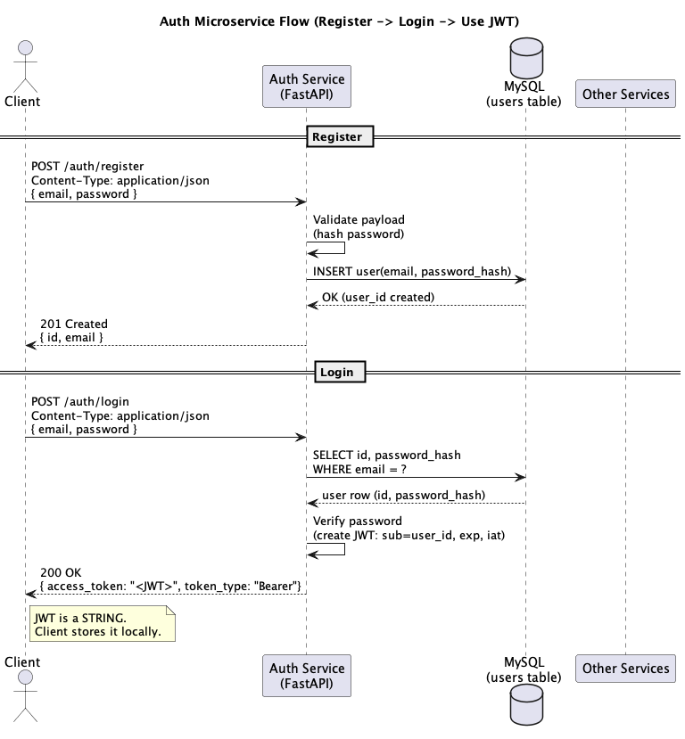

# Auth Microservice

FastAPI authentication microservice for CS361.

## Contributors
- Corey Burton
- Samuel Vernick
- Sarah Van Hoose

## requirements
- Python3.11+
- MySQL 8+
- venv

## project setup
``` 
create venv
pip install -r requirements.txt


in mysql (once running)
- host: '127.0.0.1'
- port: 3306
- db: authdb
- user: root
- pw : none 
mysql -u root < db.sql


then run main.py by ->

uvicorn app.main:app --reload --port 8000

-swagger is under http://127.0.0.1:8000/docs
```

## API Endpoints
- `GET /` health/welcome message
- `POST /auth/register` create a user account
- `POST /auth/login` verify credentials and return a token


## UML diagram


